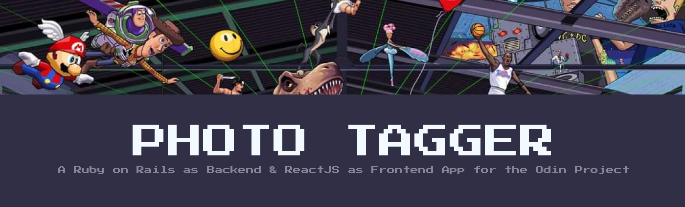

# Photo Tagger
A project built for [The Odin Project Ruby on Rails Course](https://www.theodinproject.com/paths/full-stack-ruby-on-rails/courses/javascript/lessons/where-s-waldo-a-photo-tagging-app-javascript) to deliver a working application based off the game 'Where's Waldo'. This application utilizes Ruby on Rails for the back end, and ReactJS for the front end. 

## Features
Players first select the decade they wish to play. A timer keeps track of the players score as they look for the characters to find. A list of the characters can be found by clicking on the count in the navbar. To match a character, the player clicks the location they think the character is at, then selects the correct character name from the menu. If its correct, the character menu will update and a notification will show. Once all 5 characters have been found, the timer will stop, and the player will be able to input their name for the scoreboard. The scoreboard lists the top 10 player scores for the decade played. 

## Demo 
Check out the live version [here](https://where-in-the-decades.herokuapp.com/)

## Image Credits 
All images are created by [Jimllpaintit](https://twitter.com/Jimllpaintit). 

